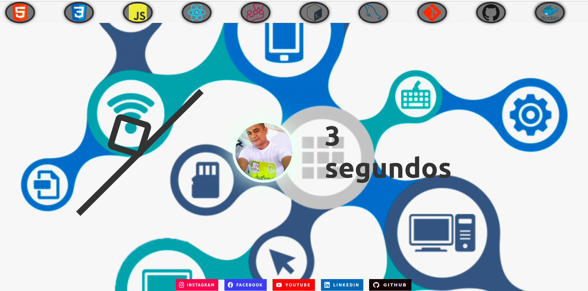

## Projeto Portifólio Pessoal:

### o que é um portifólio pessoal?

> O portfólio é uma compilação de materiais ou trabalhos desenvolvidos por um profissional (ou empresa) que demonstra suas habilidades, competências, qualificações e experiências. Um portfólio pode ser usado para atrair clientes, fechar negócios, candidatar a empregos e outros fins acadêmicos.
> [Fonte de Info](https://rockcontent.com/br/talent-blog/o-que-e-portfolio/);
